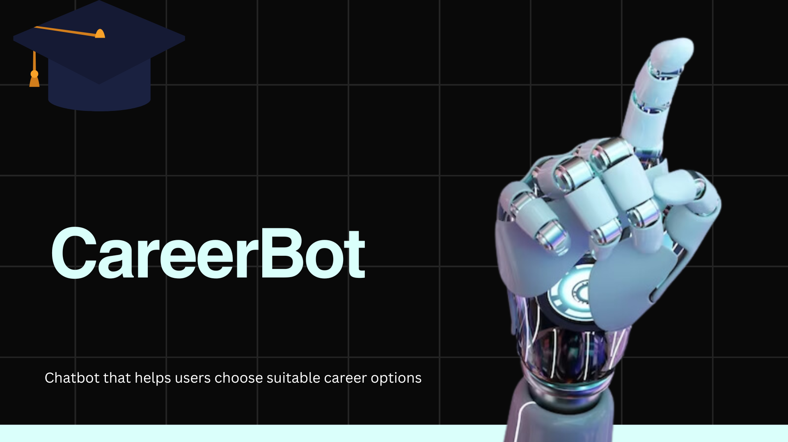

# 🎓 CareerBot AI

CareerBot AI is an intelligent and user-friendly chatbot that helps individuals explore **personalized career paths** based on their **interests**, **skills**, and **favourite school subjects**. Designed with simplicity and clarity in mind, this project demonstrates how basic AI logic can provide real-world guidance to learners and job seekers.

## 💡 Overview

CareerBot acts like a digital career counselor. Through a short interactive quiz, it guides users to discover suitable career fields using simple:
- ✅ Rule-based logic  
- 🌳 Decision-tree structures  
- 🤖 Natural language-style prompts

Whether you’re a student unsure of your direction, or an educator looking to inspire, **CareerBot AI** is a perfect starting point.

## 🌟 Key Features

✨ Interactive Q&A flow  
✨ Career suggestions based on multiple inputs  
✨ Streamlit-powered UI  
✨ Clean homepage with custom logo  
✨ Works locally or online  
✨ Beginner-friendly Python code

## 🚀 Live Demo

🟢 [Launch CareerBot AI](https://careerbot-lindiwe08.streamlit.app/)  

## 🛠 Tech Stack

| Tech        | Description                       |
|-------------|-----------------------------------|
| 🐍 Python   | Core programming language          |
| 📱 Streamlit | Lightweight UI for Python apps    |
| 🎨 Canva    | Logo and visual design             |
| 🧠 Rule Logic | Career decision-matching engine   |

👩‍💻 Author
Lindiwe Ndlazi
📫 LinkedInhttps:(//www.linkedin.com/in/ndlazi-lindiwe-76baa6229) • GitHubhttps:(https//github.com/Lindy084) • Portfoliohttps:(https://lindiwe-ndlazi-portfolio-wjb2.vercel.app/)

📌 License
This project is licensed under the MIT License.

🤝 Contributing
Feel free to fork this repo, improve it, or use it in your school/college AI showcase.
Pull requests are welcome.

“Choose a career you love, and you’ll never work a day in your life.” – Confucius

